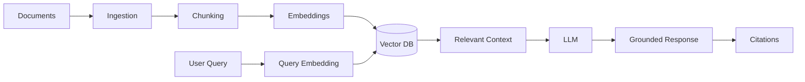
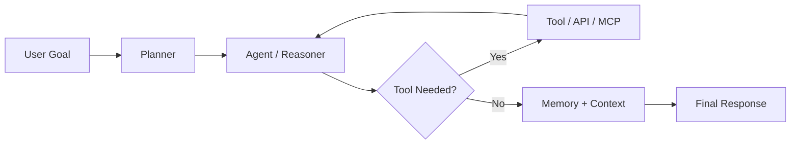

👋 Hi, I'm Pankaj Kumar
🤖 AI Engineer · Generative AI · RAG · Agentic AI · LLMs

🧠 About Me
I'm Pankaj Kumar, an AI / ML Engineer and B.Tech Computer Science & Engineering (Data Science) graduate focused on building practical AI systems.
My work has evolved from Data Science → Machine Learning → Deep Learning → Generative AI → RAG → Agentic AI → Multimodal AI.
I enjoy taking an AI idea from problem definition → data → model/LLM → retrieval → agents/tools → API → deployment → user-facing application.
- 🤖 Primary focus: Generative AI, RAG, LLM applications & Agentic AI
- 🧩 Engineering: Python, LangChain, LangGraph, FastAPI/Flask, REST APIs
- 🔎 Retrieval: ChromaDB, FAISS, embeddings, semantic search
- 👁️ AI Vision: YOLOv8, OpenCV, PyTorch, multimodal systems
- 📊 Foundation: Machine Learning, SQL, Pandas, NumPy, Power BI, Tableau
- ☁️ Deployment: Docker, cloud platforms, GitHub Pages, IBM Cloud, AWS basics
- 💼 Current role: AI/ML Engineer Intern at TheSmartBridge, Noida
- 📍 Open to: AI/ML Engineering, GenAI, RAG, Agentic AI & related engineering roles
⚡ What I Build
                 ┌──────────────────────────────┐
                 │        AI APPLICATION         │
                 └──────────────┬───────────────┘
                                │
          ┌─────────────────────┼─────────────────────┐
          ▼                     ▼                     ▼
   ┌─────────────┐       ┌─────────────┐       ┌─────────────┐
   │     RAG     │       │   AGENTS    │       │ MULTIMODAL  │
   │             │       │             │       │     AI      │
   │ Ingest      │       │ Plan        │       │ Text        │
   │ Chunk       │       │ Reason      │       │ Image       │
   │ Embed       │       │ Tools       │       │ Video       │
   │ Retrieve    │       │ Memory      │       │ Vision      │
   │ Generate    │       │ Execute     │       │ Audio       │
   └──────┬──────┘       └──────┬──────┘       └──────┬──────┘
          │                     │                     │
          └─────────────────────┼─────────────────────┘
                                ▼
                     ┌────────────────────┐
                     │ APIs + Databases   │
                     │ Cloud + Deployment │
                     └────────────────────┘
🛠️ AI Engineering Stack
🤖 Generative AI & Agentic AI

🔎 Retrieval & Vector Search

🧠 Machine Learning & Computer Vision

⚙️ Backend, Data & Deployment

📊 Analytics

🚀 Featured AI Engineering Projects
A selection of projects that best represent my current engineering direction.

<table>
<tr>
<td width="50%">

🤖 AI-Powered Customer Support Copilot
Enterprise-oriented AI assistant using RAG, LangChain, LangGraph, vector search and conversation memory.
Focus: RAG · Agents · Memory · Enterprise AI
🔗 View Repository
</td>
<td width="50%">

🧪 ResearchMind AI
Multi-agent research system using LangGraph, web research, PDF analysis, RAG and automated report generation.
Focus: Multi-Agent · Research AI · RAG
🔗 View Repository
</td>
</tr>

<tr>
<td>

📰 Multimodal Misinformation News Detector
AI system combining text + image intelligence for misinformation detection.
Focus: NLP · Transformers · Computer Vision · Multimodal AI
🔗 View Repository
</td>
<td>

📚 QuizGen AI
Turns PDF/DOCX/TXT study material into grounded, difficulty-controlled quizzes using a complete RAG pipeline.
Focus: RAG · ChromaDB · FastAPI · Streamlit
🔗 View Repository
</td>
</tr>

<tr>
<td>

📄 Policy & Process Management RAG
Enterprise assistant for querying policies and SOPs with semantic retrieval, FAISS, Sentence Transformers, Llama 3 and Gemini.
Focus: Enterprise RAG · Semantic Search · Grounded Generation
🔗 View Repository
</td>
<td>

👁️ Intelligent Video Analytics System
Computer-vision system for intelligent video analysis and real-world monitoring use cases.
Focus: Computer Vision · Video Analytics · AI Systems
🔗 View Repository
</td>
</tr>
</table>

🌿 Flagship Academic Project
ECHO — Smart Virtual Eco-Herbal Garden
An AI-enabled herbal knowledge platform combining plant recognition, digital AYUSH knowledge, voice interaction and full-stack development.
- 🏆 Best B.Tech Project — First Prize + Gold Medal
- 🎓 Research work presented at IIT Roorkee Conference 2025
- 🌱 Focused on digitizing AYUSH herbal knowledge
- 👁️ YOLOv8-based plant recognition
- 🔊 Voice / multilingual interaction
- 🌐 Full-stack web platform
🔗 View Repository
🧩 AI System Architecture
🔍 RAG

🤖 Agentic AI

💼 Experience
AI/ML Engineer Intern — TheSmartBridge
May 2026 – Present · Noida
- Building GenAI applications using LLMs, RAG, LangChain, LangGraph and AI agents.
- Developing end-to-end ML workflows from preprocessing and feature engineering through evaluation and deployment.
- Working with vector databases, REST APIs, cloud tooling and technical documentation.
- Contributing to AI/ML knowledge transfer, project demonstrations and enterprise-oriented technical work.
Data Science / ML Experience
Worked across internships and training involving:
- Python & SQL
- EDA and data preprocessing
- Predictive modelling
- ML pipelines
- NLP / LLM applications
- Power BI and analytics
- Full-stack AI applications
🏆 Achievements
Achievement	Highlight
🥇 Best B.Tech Project	First Prize + Gold Medal for ECHO
🎓 Academic	Branch Topper
📜 Degree	First Division with Distinction
🔬 Research	Herbal knowledge digitization / AI research
🎤 Conference	Research presenter at IIT Roorkee Conference 2025
🌐 Open Source	Contributor to OpenPrinting
🎙️ Speaker	Opportunity Open Source Conference 4.0
🚀 Innovation	AI/ML project demonstrations & technical presentations

🎓 Education
B.Tech — Computer Science & Engineering (Data Science)
Shri Ramswaroop Memorial College of Engineering & Management, Lucknow
2022–2026 · CGPA 8.78/10 · Branch Topper
📜 Certifications & Learning
Selected certifications / learning areas include:
- 🤖 AI Agents for Beginners — Simplilearn
- 🧠 Machine Learning with Python — IBM
- ☁️ AWS APAC Solutions Architecture — Forage
- 📊 Data Science / ML internships and simulations
- 🛰️ Application of Space Technology — IIRS / ISRO
- 🔐 Saviynt Identity Security for AI Age
- 🌐 AICTE / Edunet technical programs
- ☁️ Google Cloud / Generative AI learning
- 🔬 IBM Cloud and Big Data learning
📊 GitHub Analytics

🐍 Contribution Activity

<!-- This image becomes active after enabling the GitHub contribution-snake workflow in this repository. -->

📈 My AI Engineering Journey
Data Analytics
      │
      ▼
Machine Learning
      │
      ▼
Deep Learning
      │
      ▼
Generative AI
      │
      ▼
RAG Systems
      │
      ▼
Agentic AI
      │
      ▼
Multi-Agent Systems
      │
      ▼
Multimodal AI
      │
      ▼
Production AI Engineering
My goal: Build AI systems that are not only intelligent, but useful, measurable, deployable and maintainable.

🌱 Currently Exploring
- Advanced RAG architectures
- Agentic AI & multi-agent systems
- MCP and tool-connected AI
- LLM evaluation
- AI memory architectures
- Multimodal AI
- Production-grade AI APIs
- Cloud deployment & scalable AI systems
- AI system design
💬 Ask Me About
Python · Machine Learning · Generative AI · RAG · LangChain · LangGraph · LLMs · AI Agents · Vector Databases · Computer Vision · SQL · Power BI
🌐 Connect With Me

🚀 Building the next generation of practical AI systems.
If you're working on AI/ML, GenAI, RAG or Agentic AI — let's connect.

