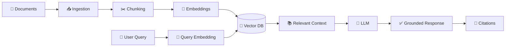
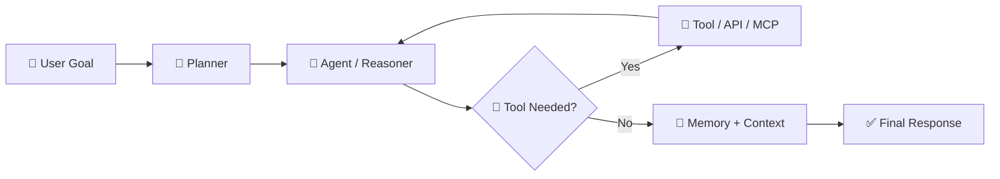
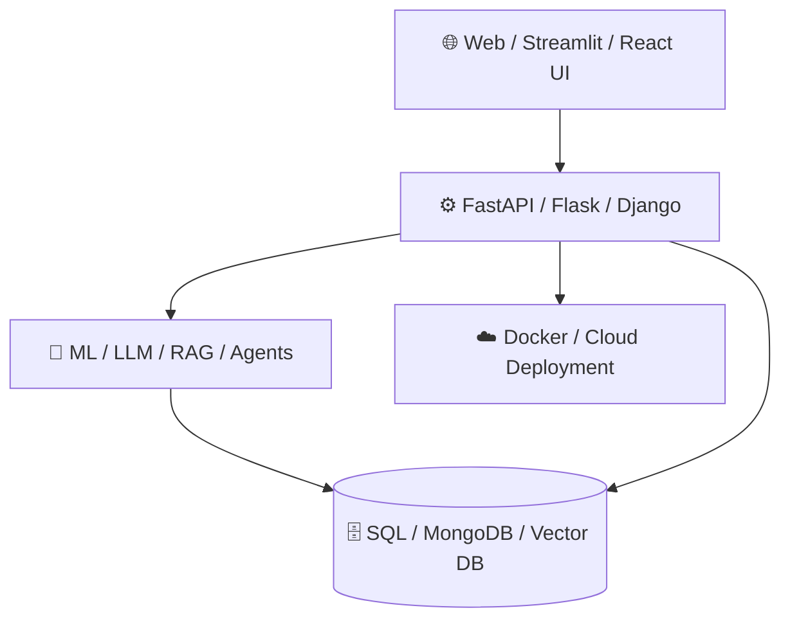

<div align="center">

# <span style="font-size:2em"><strong>👋 PANKAJ KUMAR</strong></span>

### </h3>

<p>
  <strong>AI / ML Engineer • Generative AI • RAG • Agentic AI • LLMs • Data Science • Full-Stack AI</strong>
</p>

<p>
  <a href="https://pankaj955956.github.io/Pankaj_Kumar-AI_ENGINEER__PORTFOLIO/"></a>
  <a href="https://www.linkedin.com/in/pankaj-kumar-472a29294/"></a>
  <a href="https://github.com/PANKAJ955956"></a>
  <a href="https://leetcode.com/u/PankajKumar_DS/"></a>
</p>

<p>
  
  
  
</p>

</div>

---

## 🧠 About Me

I’m **Pankaj Kumar**, an **AI / ML Engineer** and B.Tech Computer Science & Engineering (Data Science) graduate focused on turning data and AI ideas into **usable, measurable, deployable products**.

My engineering path: **Data Science → Machine Learning → Deep Learning → Generative AI → RAG → Agentic AI → Multimodal AI → Production AI Engineering**.

I build across the stack — from **data preparation, model/LLM integration and retrieval** to **agents, APIs, databases, AI-powered websites and cloud deployment**.

- 🤖 **AI Engineering:** Generative AI, LLM applications, RAG, Agentic AI, Multi-Agent Systems
- 📈 **Data Science & Analytics:** Python, SQL, EDA, Pandas, NumPy, Power BI, Tableau
- 🧩 **AI Application Development:** Streamlit, REST APIs, FastAPI, Flask, Django, React.js, Node.js
- 🔎 **Retrieval:** FAISS, ChromaDB, embeddings, semantic search, Sentence Transformers
- 👁️ **Computer Vision:** YOLOv8, OpenCV, PyTorch, multimodal AI
- ☁️ **Deployment:** Docker, IBM Cloud, GitHub Pages, AWS basics
- 💼 **Current role:** AI/ML Engineer Intern at TheSmartBridge, Noida
- 🎯 **Open to:** AI/ML Engineer, GenAI Engineer, RAG Engineer, AI Application Engineer, Full-Stack AI Engineer

---

## ⚡ What I Build

<div align="center">

```text
                           ┌─────────────────────────────┐
                           │       🚀 AI PRODUCT         │
                           │  AI App • Website • Tool    │
                           └──────────────┬──────────────┘
                                          │
            ┌─────────────────────────────┼─────────────────────────────┐
            │                             │                             │
            ▼                             ▼                             ▼
   ┌────────────────┐          ┌────────────────┐          ┌────────────────┐
   │ 🔎 RAG SYSTEMS │          │ 🤖 AI AGENTS   │          │ 👁️ MULTIMODAL │
   │ Ingest         │          │ Plan           │          │ Text           │
   │ Chunk          │          │ Reason         │          │ Image          │
   │ Embed          │          │ Tools / MCP    │          │ Video          │
   │ Retrieve       │          │ Memory         │          │ Audio          │
   │ Generate       │          │ Execute        │          │ Vision         │
   └───────┬────────┘          └───────┬────────┘          └───────┬────────┘
           │                            │                            │
           └────────────────────────────┼────────────────────────────┘
                                        ▼
                           ┌─────────────────────────────┐
                           │ 🧩 AI ENGINEERING LAYER     │
                           │ Python • LLMs • APIs • DBs  │
                           │ FastAPI • Flask • Django    │
                           └──────────────┬──────────────┘
                                          │
                              ┌───────────┴───────────┐
                              ▼                       ▼
                    ┌──────────────────┐   ┌────────────────────┐
                    │ ☁️ Cloud / Deploy │   │ 📊 Data / Analytics│
                    │ Docker • AWS     │   │ SQL • BI • EDA     │
                    └──────────────────┘   └────────────────────┘
```

</div>

---

## 🛠️ AI Engineering Stack — Official Technology Logos

> Logo badges below use the **Simple Icons** logos so the tools appear with their recognizable technology marks instead of text-only badges.

### 🤖 Generative AI • LLMs • Agentic AI

<p>
  
  
  
  
  
  
  
  
  
  
</p>

### 🔎 Retrieval • Embeddings • Vector Search

<p>
  
  
  
  
  
</p>

### 🧠 Machine Learning • Deep Learning • Computer Vision

<p>
  
  
  
  
  
  
</p>

### ⚙️ Full-Stack AI • Backend • APIs • Databases

<p>
  
  
  
  
  
  
  
  
  
  
</p>

### ☁️ Cloud • DevOps • Developer Tools

<p>
  
  
  
  
  
  
</p>

### 📊 Data Science • Analytics • Visualization

<p>
  
  
  
  
  
  
  
</p>

---

## 🚀 Featured AI Engineering Projects

<div align="center">

<table>
<tr>
<td width="50%" valign="top">

### 🤖 AI-Powered Customer Support Copilot
Enterprise-oriented AI assistant using **RAG, LangChain, LangGraph, vector search and conversation memory**.

**Focus:** RAG • Agents • Memory • Enterprise AI

<a href="https://github.com/PANKAJ955956/AI-Powered-Customer-Support-Copilot">🔗 View Repository</a>

</td>
<td width="50%" valign="top">

### 🧪 ResearchMind AI
Multi-agent research system using **LangGraph, web research, PDF analysis, RAG and automated report generation**.

**Focus:** Multi-Agent • Research AI • RAG

<a href="https://github.com/PANKAJ955956/ResearchMind-AI">🔗 View Repository</a>

</td>
</tr>

<tr>
<td valign="top">

### 📰 Multimodal Misinformation News Detector
Combines **text + image intelligence** for misinformation detection.

**Focus:** NLP • Transformers • Computer Vision • Multimodal AI

<a href="https://github.com/PANKAJ955956/multimodal-misinformation-news-detector">🔗 View Repository</a>

</td>
<td valign="top">

### 📚 QuizGen AI
Turns **PDF/DOCX/TXT** study material into grounded, difficulty-controlled quizzes using a RAG pipeline.

**Focus:** RAG • ChromaDB • FastAPI • Streamlit

<a href="https://github.com/PANKAJ955956/QuizGen-AI-Intelligent-Study-Notes-Quiz-Generator">🔗 View Repository</a>

</td>
</tr>

<tr>
<td valign="top">

### 📄 Policy & Process Management RAG
Enterprise assistant for policies and SOPs with **semantic retrieval, FAISS, Sentence Transformers, Llama 3 and Gemini**.

**Focus:** Enterprise RAG • Semantic Search • Grounded Generation

<a href="https://github.com/PANKAJ955956">🔗 Browse My GitHub</a>

</td>
<td valign="top">

### 👁️ Intelligent Video Analytics System
Computer-vision system for intelligent video analysis and real-world monitoring use cases.

**Focus:** Computer Vision • Video Analytics • AI Systems

<a href="https://github.com/PANKAJ955956/Intelligent-Video-Analytics-System">🔗 View Repository</a>

</td>
</tr>
</table>

</div>

---

## 🌿 Flagship Academic Project — ECHO

### **ECHO — Smart Virtual Eco-Herbal Garden**

An AI-enabled herbal knowledge platform combining **plant recognition, digital AYUSH knowledge, voice interaction and full-stack development**.

| Highlight | Details |
|---|---|
| 🏆 Award | **Best B.Tech Project — First Prize + Gold Medal** |
| 🎓 Research | Research work presented at **IIT Roorkee Conference 2025** |
| 🌱 Domain | Digitization of AYUSH herbal knowledge |
| 👁️ Vision | YOLOv8-based plant recognition |
| 🔊 Interaction | Voice / multilingual interaction |
| 🌐 Product | Full-stack web platform |

<a href="https://github.com/PANKAJ955956/ECHO-HERBAL-GARDEN-WEBSITE">🔗 View ECHO Repository</a>

---

## 🧩 AI System Architecture

### 🔎 RAG Pipeline

<div align="center">



</div>

### 🤖 Agentic AI Workflow

<div align="center">



</div>

### 🏗️ Full-Stack AI Product Flow

<div align="center">



</div>

---

## 💼 Experience

### AI/ML Engineer Intern — TheSmartBridge
**May 2026 – Present · Noida**

- Building GenAI applications using **LLMs, RAG, LangChain, LangGraph and AI agents**.
- Developing end-to-end ML workflows from preprocessing and feature engineering through evaluation and deployment.
- Working with vector databases, REST APIs, cloud tooling and technical documentation.
- Contributing to AI/ML knowledge transfer, project demonstrations and enterprise-oriented technical work.

### Data Science / ML Experience

Worked across internships and training involving **Python, SQL, EDA, data preprocessing, predictive modelling, ML pipelines, NLP/LLM applications, Power BI and full-stack AI applications**.

---

## 🏆 Achievements

| | Achievement |
|---|---|
| 🥇 | **Best B.Tech Project — First Prize + Gold Medal** for ECHO |
| 🎓 | **Academic Branch Topper** |
| 📜 | **First Division with Distinction** |
| 🔬 | Research on herbal knowledge digitization / AI |
| 🎤 | Research presenter at **IIT Roorkee Conference 2025** |
| 🌐 | Contributor to **OpenPrinting** |
| 🎙️ | Speaker at **Opportunity Open Source Conference 4.0** |
| 🚀 | AI/ML project demonstrations & technical presentations |

---

## 🎓 Education

**B.Tech — Computer Science & Engineering (Data Science)**  
Shri Ramswaroop Memorial College of Engineering & Management, Lucknow  
**2022–2026 · CGPA 8.78/10 · Branch Topper**

---

## 📜 Certifications & Learning

Selected areas include:

- 🤖 **AI Agents for Beginners** — Simplilearn
- 🧠 **Machine Learning with Python** — IBM
- ☁️ **AWS APAC Solutions Architecture** — Forage
- 📊 Data Science / ML internships and simulations
- 🛰️ Application of Space Technology — IIRS / ISRO
- 🔐 Saviynt Identity Security for AI Age
- 🌐 AICTE / Edunet technical programs
- ☁️ Google Cloud / Generative AI learning
- 🔬 IBM Cloud and Big Data learning

---

## 📊 GitHub Analytics

<div align="center">


<br><br>


</div>

---

## 🐍 Contribution Activity

<div align="center">

<a href="https://github.com/PANKAJ955956">
  
</a>

<br>

<a href="https://github.com/PANKAJ955956">
  
</a>

</div>

> **Snake workflow note:** the snake image requires a GitHub Actions workflow in `.github/workflows/snake.yml` that publishes `github-contribution-grid-snake.svg` to the `output` branch. The README image alone cannot generate the animation.

---

## 📈 My AI Engineering Journey

<div align="center">

```text
📊 Data Analytics
       │
       ▼
🧠 Machine Learning
       │
       ▼
🔬 Deep Learning
       │
       ▼
✨ Generative AI
       │
       ▼
🔎 RAG Systems
       │
       ▼
🤖 Agentic AI
       │
       ▼
🧩 Multi-Agent Systems
       │
       ▼
👁️ Multimodal AI
       │
       ▼
🚀 Production AI Engineering
```

**Goal:** build AI systems that are not only intelligent, but **useful, measurable, deployable and maintainable**.

</div>

---

## 🌱 Currently Exploring

**Advanced RAG architectures • Agentic AI & multi-agent systems • MCP and tool-connected AI • LLM evaluation • AI memory architectures • Multimodal AI • Production-grade AI APIs • Cloud deployment • Scalable AI systems • AI system design**

---

## 💬 Ask Me About

**Python • Machine Learning • Generative AI • RAG • LangChain • LangGraph • LLMs • AI Agents • Vector Databases • Computer Vision • FastAPI • Flask • Django • SQL • Power BI**

---

## 🌐 Connect With Me

<div align="center">

<a href="https://pankaj955956.github.io/Pankaj_Kumar-AI_ENGINEER__PORTFOLIO/"></a>
<a href="https://www.linkedin.com/in/pankaj-kumar-472a29294/"></a>
<a href="https://github.com/PANKAJ955956"></a>
<a href="https://leetcode.com/u/PankajKumar_DS/"></a>
<a href="mailto:pankaj955956@gmail.com"></a>

<br><br>

### 🚀 Building practical AI systems from data → intelligence → product.


</div>
